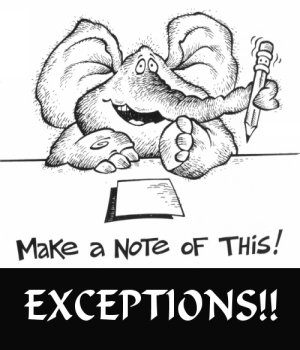

# JavaScript 异常档案

这里是 JavaScript 异常的维基百科站，用于收集、组织、分享前端开发同学遇到的
JavaScript 异常，沉淀 JavaScript 异常知识，供异常分析 & 处理参考。

## 常见异常

* [错误的数量词](./wiki/unexpected-quantifier.md)
* [正则表达式语法错误](./wiki/regular-expression-syntax-error.md)
* [正则表达式中缺少 'XXX'](./wiki/expected-xxx-in-regular-expression.md)

[查看更多](./wiki/index.md)

## 参考

* [错误][1] ,
    [JavaScript 错误](http://msdn.microsoft.com/zh-cn/library/7th8s2xk%28v=vs.94%29.aspx), 
    [JavaScript Errors](http://msdn.microsoft.com/en-us/library/ie/7th8s2xk%28v=vs.94%29.aspx)
* [JScript 运行时错误](http://msdn.microsoft.com/zh-cn/library/cekc4228%28v=vs.90%29.aspx) ,
    [JavaScript 运行时错误](http://msdn.microsoft.com/zh-cn/library/1dk3k160%28v=vs.94%29.aspx)
    [JavaScript Run-time Errors](http://msdn.microsoft.com/en-us/library/ie/1dk3k160%28v=vs.94%29.aspx)
* [JScript 语法错误](http://msdn.microsoft.com/zh-cn/library/by0atdkw%28v=vs.90%29.aspx) ,
    [JavaScript Syntax Errors](http://msdn.microsoft.com/en-us/library/ie/6bby3x2e%28v=vs.94%29.aspx)
* [Handling and Avoiding Web Page Errors Part 1: The Basics](http://msdn.microsoft.com/en-us/library/ms976140.aspx)
* [Handling and Avoiding Web Page Errors Part 2: Run-Time Errors](http://msdn.microsoft.com/en-us/library/ms976144.aspx)
* [Handling and Avoiding Web Page Errors Part 3: An Ounce of Prevention](http://msdn.microsoft.com/en-us/library/ms976146.aspx)
* [Windows事件代码ID及错误信息](./wiki/windows-event-code-id-and-error-message.md)

[1]: http://msdn.microsoft.com/zh-cn/library/3a3syxc5(v=vs.90).aspx

## 分享

* [JavaScript Debugging Techniques in IE 6](http://sixrevisions.com/javascript/javascript-debugging-techniques-in-ie-6/)
* [Best Practices for Exception Handling](http://www.onjava.com/pub/a/onjava/2003/11/19/exceptions.html)
    * [译：异常处理的最佳实践](http://itindex.net/detail/37579-%E5%BC%82%E5%B8%B8%E5%A4%84%E7%90%86-%E6%9C%80%E4%BD%B3%E5%AE%9E%E8%B7%B5)
    * [译：异常处理之最佳实践（Best Practices for Exception Handling ）](http://blog.csdn.net/kesay/article/details/5393778)
* [异常处理最佳实践](http://www.juvenxu.com/2011/03/30/exception-handling-best-practices/)
* [处理 JS 异常的一个想法 - sofish](http://sofish.de/2144)
* [浏览器错误捕捉总结](https://gist.github.com/neekey/4371159)
* [.NET中异常处理最佳实践](http://developer.51cto.com/art/200611/34741.htm)
* [IE Error Languages](https://github.com/errorception/ie-error-languages)
* [Enable CORS](http://enable-cors.org/)
